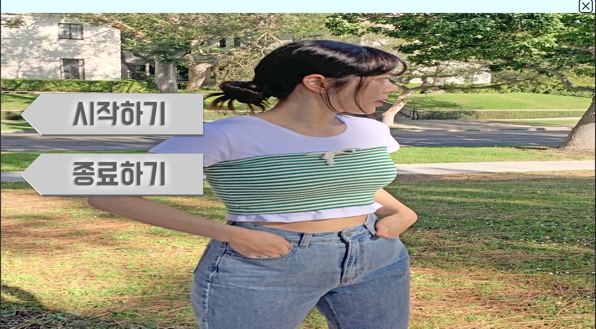
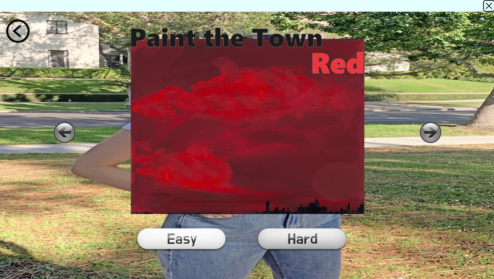
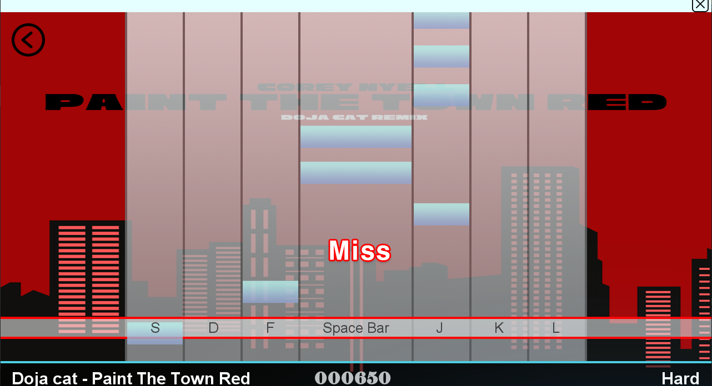
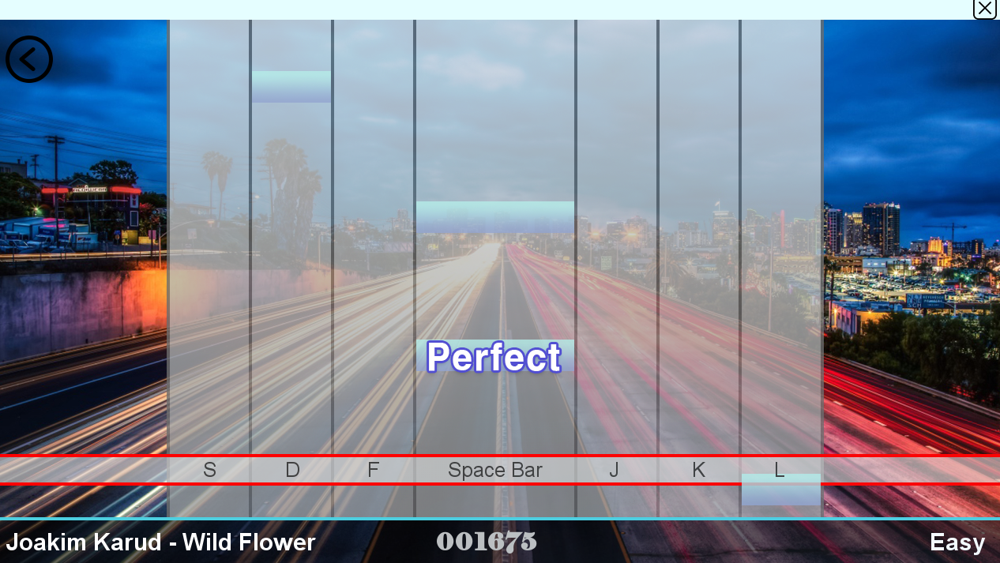

# Rhythm_game

A Java-based rhythm game where you press keys in time with falling notes.

## Game Overview

This Rhythm_game is a rhythm game developed using Java Swing, where players earn points by pressing keyboard inputs in sync with notes falling to the beat of music. Players can select from various music tracks and difficulty levels, with more accurate timing resulting in higher scores.

## Key Features

- Multiple music tracks to choose from
- Easy/Hard difficulty options
- Keyboard gameplay (S, D, F, Space, J, K, L)
- Judgment system (Perfect, Great, Good, Early, Late, Miss)
- Visual effects and sound feedback

## How to Play

1. Launch the game and click the start button
2. Select your desired music and difficulty (Easy/Hard)
3. Press the corresponding keys (S, D, F, Space, J, K, L) when notes reach the judgment line
4. Aim for perfect timing to achieve the highest score

## Music Tracks

The game features the following music tracks:
- Mighty Love
- Wild Flower
- Energy
- Paint the Town Red

Note: These music files are not included in the repository due to copyright considerations. For educational purposes only.

## Development Environment

- Java 8
- JLayer 1.0.1 (for MP3 playback)

## Screenshots

### Start Screen

### Song Selection Screen

### Gameplay Screen

### Gameplay with Effects

## Acknowledgments

- Music creators for the tracks used in the game
- JLayer library developers
